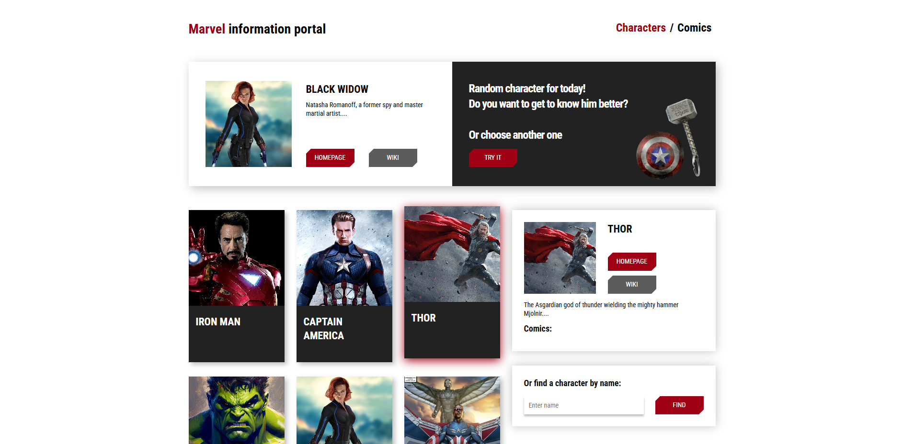
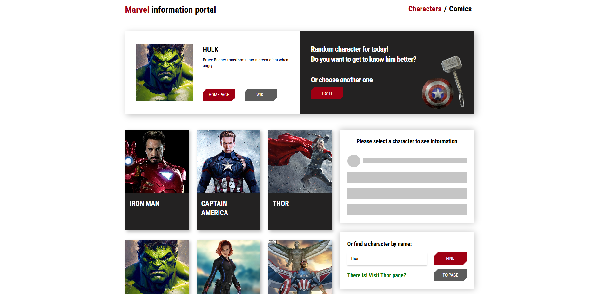
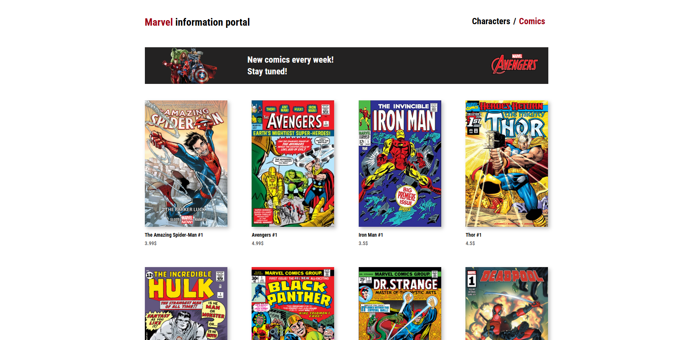
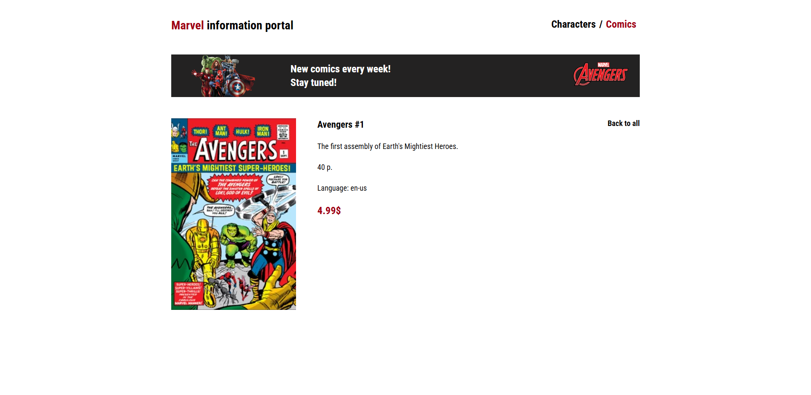
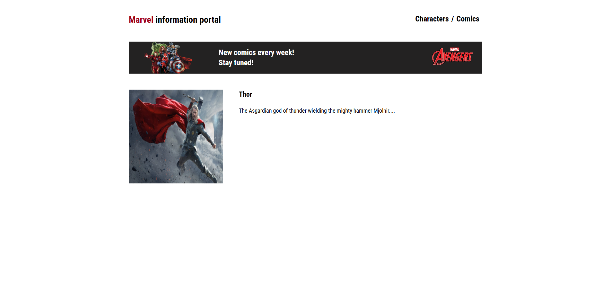

# Marvel Information Portal

A React project based on the Marvel universe. I built it while studying React and then continued improving it step by step: moved components to functional components, added routing, loading/error states, a search form, and deployment to GitHub Pages.

Live demo: [https://VladProtsyshyn.github.io/marvel](https://VladProtsyshyn.github.io/marvel)

## About The Project

The app lets users browse Marvel characters and comics, open detail pages, and search for a character by name. The main goal of this project was to practice real React patterns, not just static layout.

I worked on:

- refactoring class components to functional components;
- working with React hooks;
- routing with `react-router-dom`;
- loading, error, waiting, and confirmed states using an FSM-style approach;
- reusable service logic for API requests;
- Formik and Yup for the character search form;
- deployment to GitHub Pages;
- code splitting with React.lazy and Suspense.

## Features

- Random character block on the main page.
- Character list with "load more" behavior.
- Character details panel.
- Search form for finding a character by name.
- Comics page with pagination.
- Separate pages for comic details and character details.
- Loading spinners, skeleton UI, and error states.
- Client-side routing.
- Lazy-loaded pages with a fallback spinner.
- API layer with data transformation before rendering.
- Basic accessibility work for keyboard selection in the character list.

## Tech Stack

- React
- React Router
- Formik
- Yup
- Sass
- Create React App
- GitHub Pages
- Marvel API data

## Screenshots

Screenshots should be placed in:

```text
docs/screenshots/
```

Use these file names:

```text
characters-page.png
character-search.png
comics-page.png
comic-details-page.png
character-details-page.png
```

After adding the screenshots, they will be shown here:

### Characters Page



### Character Search



### Comics Page



### Comic Details Page



### Character Details Page



## What I Practiced

This project helped me practice several important React topics:

- component decomposition;
- props and state management;
- `useState`, `useEffect`, `useRef`, and `useMemo`;
- custom hooks;
- useCallback for reusable request logic;
- useRef for focusing selected character cards;
- useMemo for memoized rendering;
- PropTypes for component props validation;
- API requests and response transformation;
- conditional rendering;
- finite-state-machine style UI states;
- form validation;
- dynamic routes with useParams;
- lazy loading pages with React.lazy and Suspense;
- deployment flow.

## Getting Started

Install dependencies:

```bash
npm install
```

Run the project locally:

```bash
npm start
```

Build the project:

```bash
npm run build
```

Deploy to GitHub Pages:

```bash
npm run deploy
```

## Notes

The project uses GitHub Pages, so the router is configured with the `/marvel` base path.

I plan to continue improving the project: clean up remaining course-related code, polish the UI, and keep the README updated with screenshots.

